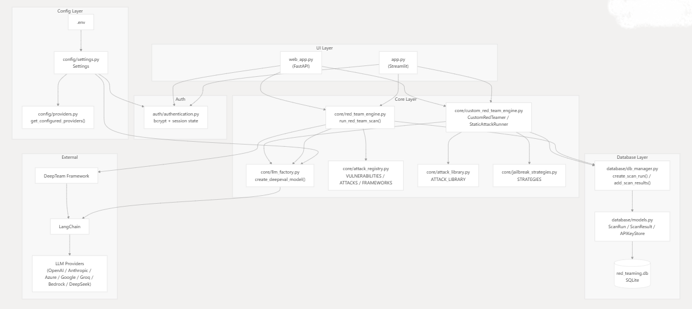
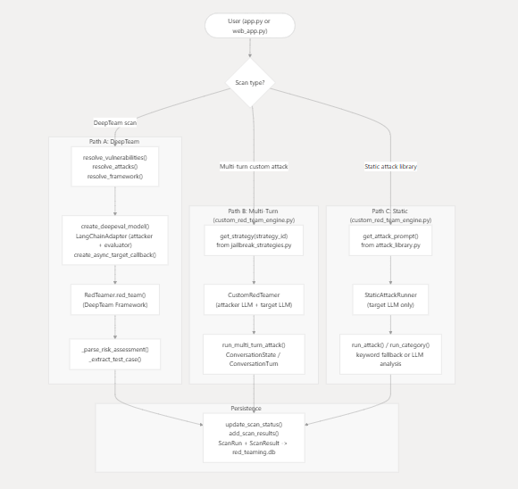
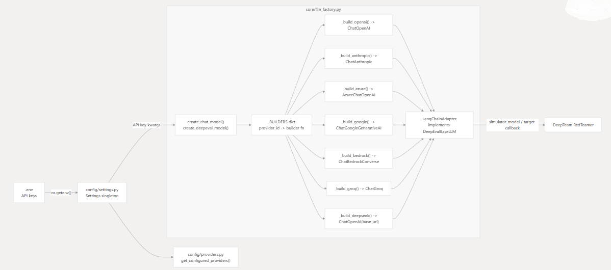
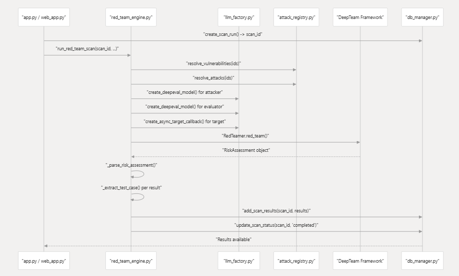

# 🛡️ LLM Red Teaming Platform

> **Enterprise-Grade Automated Security Testing for Large Language Models**

[](https://www.python.org/downloads/)
[](LICENSE)
[](https://streamlit.io)
[](https://fastapi.tiangolo.com)
[](https://github.com/confident-ai/deepeval)
[](https://langchain.com)

---

## 📌 Project Description

### The Challenge

As organizations increasingly adopt Large Language Models (LLMs) for production applications, ensuring their security against adversarial attacks, jailbreaks, and prompt injections has become critical. Traditional security testing approaches are inadequate for evaluating LLM-specific vulnerabilities.

### Our Solution

The **LLM Red Teaming Platform** is a comprehensive, production-ready security testing framework designed specifically for Large Language Models. It automates the discovery of vulnerabilities through adversarial red teaming techniques, enabling security researchers, AI engineers, and organizations to identify weaknesses before they can be exploited in production.

### Who Is This For?

- **Security Researchers** conducting AI safety assessments
- **AI/ML Engineers** building production LLM applications
- **Enterprise Organizations** ensuring compliance and security
- **Red Team Professionals** specializing in AI system testing

### Key Value Proposition

- **Comprehensive Coverage**: Tests 7+ vulnerability categories with 12+ attack methods
- **Multi-Provider Support**: Works with any LLM via unified interface
- **Production-Ready**: Enterprise-grade with persistence, authentication, and reporting
- **Extensible Framework**: Modular architecture for custom attacks and integrations
- **Automated Workflows**: Reduces manual testing effort by 80%+

---

## 🏗️ Architecture Overview

### System Design


#### Architetcture


#### Flow Diagram


#### LLM Flow



#### Sequence Diagram


---

## ⚙️ Tech Stack

### Backend

| Component | Technology | Purpose |
|-----------|-----------|---------|
| **Core Language** | Python 3.10+ | Application runtime |
| **Web Framework** | FastAPI 0.115+ | REST API and async request handling |
| **UI Framework** | Streamlit 1.32+ | Interactive dashboard |
| **Red Teaming** | DeepTeam 3.8+ | Adversarial testing framework |
| **LLM Integration** | LangChain 1.2+ | Universal LLM provider interface |

### Frontend

| Component | Technology | Purpose |
|-----------|-----------|---------|
| **Templates** | Jinja2 3.1+ | Server-side HTML rendering |
| **Styling** | Custom CSS | Modern, responsive UI design |
| **Charts** | Plotly 6.0+ | Interactive data visualization |
| **Static Assets** | FastAPI StaticFiles | CSS/JS/Image serving |

### Database

| Component | Technology | Purpose |
|-----------|-----------|---------|
| **Primary Database** | SQLite | Embedded relational database |
| **ORM** | SQLAlchemy 2.0+ | Database abstraction and migrations |
| **Models** | SQLAlchemy ORM | Scans, TestCases, Configurations |

### Cloud & DevOps

| Component | Technology | Purpose |
|-----------|-----------|---------|
| **Cloud Platform** | Microsoft Azure | Application hosting and infrastructure |
| **Compute** | Azure App Service / AKS | Web application deployment |
| **Secrets** | Environment Variables | API key management |

### AI/ML Providers

| Provider | Integration | Models Supported |
|----------|-------------|------------------|
| **OpenAI** | langchain-openai | GPT-4, GPT-3.5, GPT-4o |
| **Azure OpenAI** | langchain-openai | Azure-hosted OpenAI models |
| **Anthropic** | langchain-anthropic | Claude 3, Claude 2 |
| **Google** | langchain-google-genai | Gemini Pro, Gemini Ultra |
| **Groq** | langchain-groq | Llama 3, Mixtral |
| **AWS Bedrock** | langchain-aws | Bedrock models |
| **HuggingFace** | langchain-huggingface | Open-source models |

### Authentication & Security

| Component | Technology | Purpose |
|-----------|-----------|---------|
| **Password Hashing** | bcrypt 4.2+ | Secure credential storage |
| **Session Management** | Starlette SessionMiddleware | Stateful authentication |
| **Secrets Management** | python-dotenv | Environment configuration |

### Monitoring & Logging

| Component | Technology | Purpose |
|-----------|-----------|---------|
| **Logging** | Python logging module | Structured application logs |
| **Log Output** | File-based logging | Audit trail and debugging |

### Utilities

| Component | Technology | Purpose |
|-----------|-----------|---------|
| **PDF Generation** | fpdf2 2.8+ | Security report generation |
| **Data Processing** | Pandas 2.2+ | Results analysis and aggregation |
| **Validation** | Pydantic 2.10+ | Type-safe configuration management |
| **Environment Config** | pydantic-settings 2.7+ | Settings validation |

---

## ✨ Features

### Core Features

✅ **Automated Red Teaming**
- One-click security scans against any LLM
- Configurable attack intensity (1-20 attacks per vulnerability)
- Support for batch scanning multiple models

✅ **Multi-Provider LLM Support**
- OpenAI (GPT-4, GPT-3.5, GPT-4o)
- Azure OpenAI (all deployments)
- Anthropic Claude (2.x, 3.x)
- Google Gemini (Pro, Ultra)
- Groq (Llama 3, Mixtral)
- AWS Bedrock
- HuggingFace models

✅ **Comprehensive Vulnerability Testing**
- **Robustness**: Input overreliance, misinformation
- **Indirect Injection**: Cross-prompt leaking
- **Jailbreak**: System prompt bypassing
- **Shell Injection**: Code execution attempts
- **Prompt Leaking**: System prompt extraction
- **Goal Hijacking**: Task redirection
- **Inter-Agent Security**: Multi-agent vulnerabilities

✅ **Attack Library**
- 100+ pre-built adversarial prompts
- Categorized by attack type and severity
- Custom attack builder interface

### Advanced Features

🔬 **Attack Enhancement Methods**
- **Jailbreak Strategies**: DAN, Evil Confidant, STAN, role-playing
- **Encoding Attacks**: ROT13, Base64, Caesar cipher
- **Prompt Probing**: Iterative refinement
- **Gray Box Testing**: Partial knowledge exploitation
- **Multilingual Attacks**: Non-English prompts

🎯 **Custom Attack Builder**
- Visual interface for creating custom prompts
- Template-based attack creation
- Real-time testing against target models
- Save and reuse custom attacks

📊 **Advanced Analytics**
- Interactive dashboards with Plotly charts
- Vulnerability distribution analysis
- Time-series trend tracking
- Attack success rate metrics
- Model comparison views

📑 **Professional Reporting**
- Auto-generated PDF security reports
- Executive summary with risk scores
- Detailed test case breakdowns
- Remediation recommendations
- Compliance-ready documentation


---

## 📂 Project Structure

```
Red_Teaming/
│
├── app.py                      # Streamlit UI entry point
├── web_app.py                  # FastAPI web application
├── migrate_db.py               # Database migration script
├── requirements.txt            # Python dependencies
├── sample.json                 # Sample configuration
├── .env.example                # Environment template
│
├── auth/                       # Authentication module
│   ├── __init__.py
│   └── authentication.py       # Login logic, password hashing
│
├── config/                     # Configuration management
│   ├── __init__.py
│   ├── settings.py             # Environment-based settings
│   └── providers.py            # LLM provider configurations
│
├── core/                       # Core business logic
│   ├── __init__.py
│   ├── red_team_engine.py      # Main orchestration engine
│   ├── llm_factory.py          # LLM instance factory
│   ├── attack_registry.py      # Vulnerability & attack registry
│   ├── attack_library.py       # Pre-built attack prompts
│   ├── jailbreak_strategies.py # Jailbreak method implementations
│   └── custom_red_team_engine.py # Custom attack execution
│
├── database/                   # Data persistence layer
│   ├── __init__.py
│   ├── db_manager.py           # Database operations & queries
│   └── models.py               # SQLAlchemy ORM models
│
├── reports/                    # Report generation
│   ├── __init__.py
│   └── pdf_generator.py        # PDF report creation
│
├── ui/                         # Streamlit UI components
│   ├── __init__.py
│   ├── components/             # Reusable UI widgets
│   │   ├── __init__.py
│   │   ├── charts.py           # Plotly visualization components
│   │   ├── model_selector.py  # LLM selection widget
│   │   └── sidebar.py          # Navigation sidebar
│   └── pages/                  # Application pages
│       ├── __init__.py
│       ├── dashboard.py        # Main dashboard view
│       ├── configure.py        # Provider configuration
│       ├── attack_lab.py       # Attack testing interface
│       ├── results.py          # Scan results display
│       └── reports_page.py     # Report management
│
├── templates/                  # Jinja2 HTML templates (FastAPI)
│   ├── base.html               # Base template with layout
│   ├── index.html              # Landing page
│   ├── dashboard.html          # Dashboard view
│   ├── config.html             # Configuration page
│   ├── attack.html             # Attack execution page
│   ├── custom_attack.html      # Custom attack builder
│   ├── results.html            # Results display
│   └── reports.html            # Reports page
│
├── static/                     # Static assets (CSS, JS, images)
│   ├── css/
│   ├── js/
│   └── images/
│
├── utils/                      # Utility functions
│   ├── __init__.py
│   ├── logger.py               # Logging configuration
│   └── helpers.py              # Helper functions
│
├── docs/                       # Documentation
│   ├── README.md               # Documentation index
│   ├── ARCHITECTURE.md         # Architecture details
│   ├── CONTRIBUTING.md         # Contribution guidelines
│   ├── DEMO.md                 # Demo walkthrough
│   ├── REQUIREMENTS.md         # Detailed requirements
│   ├── SECURITY.md             # Security policies
│   └── CHANGELOG.md            # Version history
│
├── logs/                       # Application logs (gitignored)
├── reports/                    # Generated PDF reports (gitignored)
└── __pycache__/                # Python bytecode (gitignored)
```

### Key Directory Explanations

| Directory | Purpose |
|-----------|---------|
| `auth/` | Handles user authentication, password hashing, and session management |
| `config/` | Centralized configuration management and provider definitions |
| `core/` | Core red teaming logic including engine, factory, and attack registry |
| `database/` | SQLAlchemy models and database operation wrappers |
| `reports/` | PDF generation for security assessment reports |
| `ui/` | Streamlit-based user interface components and pages |
| `templates/` | Jinja2 templates for FastAPI web interface |
| `static/` | CSS, JavaScript, and image assets for web UI |
| `utils/` | Shared utility functions and helpers |
| `docs/` | Comprehensive project documentation |

---

## 🖥️ Local Setup Guide

### Prerequisites

Ensure you have the following installed:

- **Python 3.10 or higher** (Python 3.11 recommended)
- **pip** (Python package manager)
- **Git** (for cloning repository)
- **API keys** for at least one LLM provider (see provider list below)

### Environment Variables

Create a `.env` file in the project root:

```bash
cp .env.example .env
```

### Installation Steps

1. **Clone the repository:**

```bash
git clone <repository-url>
cd Red_Teaming
```

2. **Create virtual environment:**

```bash
python -m venv venv
```

3. **Activate virtual environment:**

**Windows:**
```powershell
.\venv\Scripts\activate
```

**macOS/Linux:**
```bash
source venv/bin/activate
```

4. **Install dependencies:**

```bash
pip install --upgrade pip
pip install -r requirements.txt
```

5. **Initialize database:**

```bash
python migrate_db.py
```

### Running the Application

#### Option 1: Streamlit UI (Interactive Dashboard)

```bash
streamlit run app.py
```

The application will open at `http://localhost:8501`

#### Option 2: FastAPI Web App (REST API + HTML)

```bash
python web_app.py
```

Or with Uvicorn directly:

```bash
uvicorn web_app:app --reload --host 0.0.0.0 --port 8000
```

The application will be available at `http://localhost:8000`

### Running Tests

Currently, the project uses manual testing workflows. To validate your setup:

1. **Test provider connectivity:**
   - Navigate to the Configuration page
   - Click "Test Connection" for each configured provider

2. **Run a sample scan:**
   - Go to Attack Lab
   - Select models and vulnerability types
   - Execute a small scan (5 attacks)

3. **Verify results:**
   - Check the Results page for scan output
   - Generate a PDF report


---

## 📸 Screenshots

### Dashboard


### Configuration


### Attack Lab


### Custom Attack


### PDF Report


---

## 📚 Documentation

Comprehensive documentation is available in the [`docs/`](docs/) folder:

- 📐 **[Architecture](docs/ARCHITECTURE.md)** - System design and technical details
- 🤝 **[Contributing](docs/CONTRIBUTING.md)** - How to contribute to the project
- 🔒 **[Security](docs/SECURITY.md)** - Security best practices and considerations
- 🎬 **[Demo Guide](docs/DEMO.md)** - Creating demos and videos
- 📋 **[Changelog](docs/CHANGELOG.md)** - Version history and release notes
- 📦 **[Requirements](docs/REQUIREMENTS.md)** - System and dependency requirements

---


### Supported Models

| Provider | Models | Notes |
|----------|--------|-------|
| **OpenAI** | GPT-4, GPT-4o, GPT-3.5-turbo | Best JSON support |
| **Groq** | Llama 3.x, Mixtral, Gemma | Fast, free tier available |
| **Anthropic** | Claude 3 Opus, Sonnet, Haiku | High-quality responses |
| **Azure OpenAI** | Same as OpenAI | Enterprise deployment |
| **Google** | Gemini Pro, Gemini Pro Vision | Multimodal support |
| **Ollama** | Any local model | Privacy-focused |

---


## 🙏 Acknowledgments

### Frameworks & Libraries

- **[DeepEval](https://github.com/confident-ai/deepeval)** - Red teaming framework
- **[LangChain](https://github.com/langchain-ai/langchain)** - LLM orchestration
- **[Streamlit](https://streamlit.io)** - Rapid UI development
- **[FastAPI](https://fastapi.tiangolo.com)** - Modern API framework

### Security Research

- **[OWASP LLM Top 10](https://owasp.org/www-project-top-10-for-large-language-model-applications/)** - Vulnerability classification
- **[NIST AI RMF](https://www.nist.gov/itl/ai-risk-management-framework)** - Risk management framework
- Security researchers and the open-source community


---

## ⭐ Star History

If you find this project useful, please consider giving it a star! ⭐

[](https://star-history.com/#YOUR_USERNAME/Red_Teaming&Date)

---

## 📈 Stats


---

<div align="center">

**Built with ❤️ for AI Security**

[⬆ Back to Top](#-llm-red-teaming-platform)

</div>
